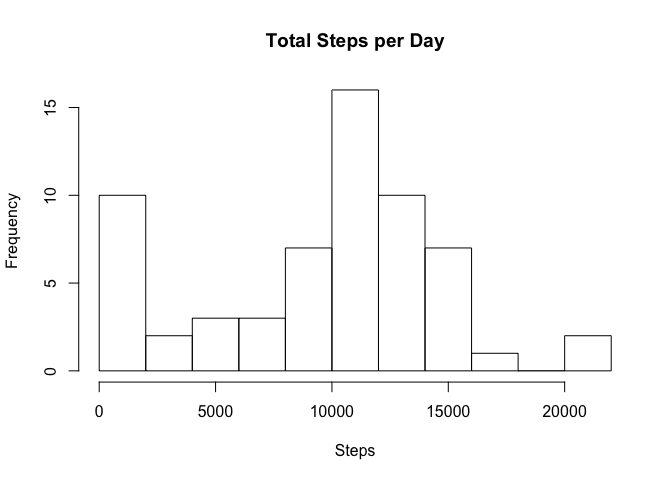
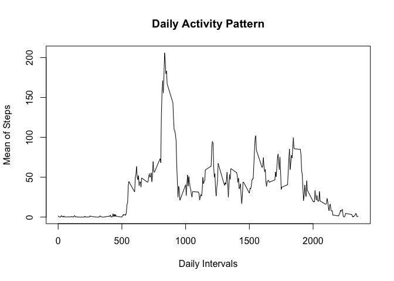
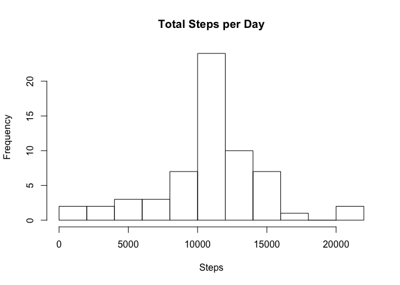

# Reproducible Research: Peer Assessment 1


## Introduction
It is now possible to collect a large amount of data about personal movement using activity monitoring devices such as a Fitbit, Nike Fuelband, or Jawbone Up. These type of devices are part of the "quantified self" movement -- a group of enthusiasts who take measurements about themselves regularly to improve their health, to find patterns in their behavior, or because they are tech geeks. But these data remain under-utilized both because the raw data are hard to obtain and there is a lack of statistical methods and software for processing and interpreting the data.

This assignment makes use of data from a personal activity monitoring device. This device collects data at 5 minute intervals through out the day. The data consists of two months of data from an anonymous individual collected during the months of October and November, 2012 and include the number of steps taken in 5 minute intervals each day.  

## Data
The data for this assignment can be downloaded from this web site:
[Activity monitoring data](https://d396qusza40orc.cloudfront.net/repdata%2Fdata%2Factivity.zip) (52K).
The variables included in this dataset are:

- steps: Number of steps taking in a 5-minute interval (missing values are coded as ????????)
- date: The date on which the measurement was taken in YYYY-MM-DD format
- interval: Identifier for the 5-minute interval in which measurement was taken  

The dataset is stored in a comma-separated-value (CSV) file and there are a total of 17,568 observations in this dataset.


## Loading and preprocessing the data
This shows the code that is needed to

1. Load the data (i.e. `read.csv()`)
2. Process/transform the data (if necessary) into a format suitable for your analysis

The working directory must be set to the location where the rmd-File is. 

```r
# Read data from file
act <- read.csv(unz("activity.zip", "activity.csv"), header = TRUE, sep = ",")
# Convert date format
act$date = as.Date(as.character(act$date), "%Y-%m-%d")
```


## What is mean total number of steps taken per day?
The missing values in the dataset can be ignored. The following code shows

1. How to Make a histogram of the total number of steps taken each day
2. How the **mean** and **median** of the total number of steps taken per day are calculated and reported 


```r
# Apply the sum() function to the days 
num_steps <- tapply(act$steps, act$date, sum, na.rm = T) 
# Plot a histogram
hist(num_steps, xlab = "Steps", main = "Total Steps per Day", breaks = 10)
```

 

```r
# Apply the mean() function and the median() function to the total number of steps calculate above
mean(num_steps)
```

```
## [1] 9354.23
```

```r
median(num_steps)
```

```
## [1] 10395
```
  

## What is the average daily activity pattern?
This section shows

1. How to make a time series plot (i.e. `type = "l"`) of the 5-minute interval (x-axis) and the average number of steps taken, averaged across all days (y-axis)


```r
# Apply the mean() function to daily intervals 
int_steps <- aggregate(act$steps, by = list(act$interval), FUN = mean, na.rm = T) 
# Plot the time series
plot(x = int_steps[,1], y = int_steps[,2], type = "l", xlab = "Daily Intervals", ylab = "Mean of Steps", main = "Daily Activity Pattern")
```

 

2. Which 5-minute interval, on average across all the days in the dataset, contains the maximum number of steps


```r
# Use the max() function to evaluate the interval with the maximum number of steps 
int_steps[which.max(int_steps[,2]),1]
```

```
## [1] 835
```

## Imputing missing values
The presence of missing days may introduce bias into some calculations or summaries of the data.
Therefor the following is done:

1. Calculate and report the total number of missing values in the dataset (i.e. the total number of rows with `NA`s)


```r
NAs <- sum(apply(is.na(act), 1, any))
```

2. Devise a strategy for filling in all of the missing values in the dataset. 


```r
# Create a function  to replace  missing values with the mean value of its 5-minute interval
NA.replace <- function(steps, interval) {
    value <- NA
    if (is.na(steps)) 
        value <- int_steps[int_steps[, 1] == interval , 2]
    else
        value <- steps
    return(value)
}
```

3. Create a new dataset that is equal to the original dataset but with the missing data filled in.


```r
act_new <- act
act_new$steps <- mapply(NA.replace, act_new$steps, act_new$interval)
NAs_now <- sum(apply(is.na(act_new), 1, any))
```
The total number of missing values in the data is now 0.  

4. Make a histogram of the total number of steps taken each day and Calculate and report the **mean** and **median** total number of steps taken per day.


```r
# Apply the sum() function to the days 
num_steps_new <- tapply(act_new$steps, act_new$date, sum) 
# Plot a histogram
hist(num_steps_new, xlab = "Steps", main = "Total Steps per Day", breaks = 10)
```

 

```r
# Apply the mean() function and the median() function to the total number of steps calculate above
mean(num_steps_new)
```

```
## [1] 10766.19
```

```r
median(num_steps_new)
```

```
## [1] 10766.19
```
The new mean of total number steps per day and the new median of total number steps per day is slightly higer than the original mean and median of the first part of the assignment.


## Are there differences in activity patterns between weekdays and weekends?
In this section the following data manipulation is executed:

1. Create a new factor variable in the dataset with two levels -- "weekday" and "weekend" indicating whether a given date is a weekday or weekend day.


```r
# Create a function to decide if a given date is a weekday or weekend
weekday.weekend <- function(date) {
    value <- NA
    if (weekdays(date) %in% c("Sunday", "Saturday")) 
        value <- "weekend"
    else
        value <- "weekday"
    return(value)
}
```

Use of this function to create a new factor variable in the new dataset.

```r
act_new$day <- mapply(weekday.weekend, act_new$date)
```

1. Make a panel plot containing a time series plot (i.e. `type = "l"`) of the 5-minute interval (x-axis) and the average number of steps taken, averaged across all weekday days or weekend days (y-axis). 


```r
# Apply the mean() function to daily intervals
int_steps <- aggregate(act_new$steps, by = list(act_new$interval, act_new$day), FUN = mean)
# Plot the time series panels
library(lattice)
xyplot(x ~ Group.1 | Group.2, data = int_steps, type = "l", layout = c(1, 2), xlab = "Interval", ylab = "Number of Steps")
```

 


